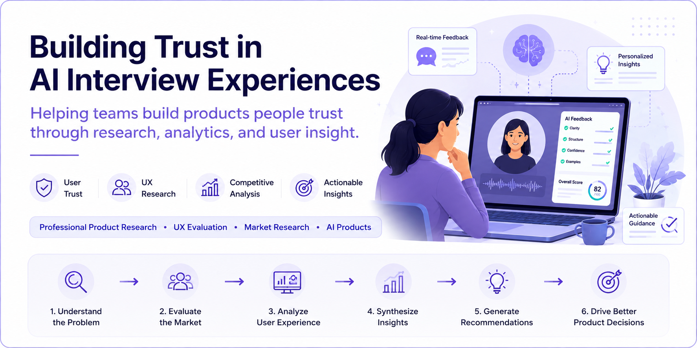

<p align="center">
  
</p>

# Building Trust in AI Interview Experiences

> **Professional Product Research • UX Research • Competitive Analysis • AI Product Research**

Helping teams build AI products people trust through research, analytics, and user insight.

---

## 🔒 Confidentiality

This case study is adapted from my professional experience working on AI-powered products.

To respect confidentiality obligations, proprietary information—including product screenshots, internal metrics, customer data, competitive analyses, and company-specific findings—has been intentionally omitted or generalized.

The purpose of this case study is to demonstrate my research process, analytical thinking, and product decision-making approach.

> **Note:** Editorial illustrations are used in place of proprietary product screenshots.

---

# Project Snapshot

| Category | Details |
|----------|---------|
| **Role** | Product Researcher |
| **Project Type** | Professional Product Research |
| **Duration** | February 2026 – Present |
| **Research Areas** | AI Product Research, UX Evaluation, Competitive Analysis |
| **Methods** | Competitive Analysis, Product Evaluation, User Interviews, UX Evaluation, Market Research, Research Synthesis |
| **Participants** | ~15 users |
| **Deliverables** | Product Recommendations, Competitive Analysis, UX Evaluations, Executive Research Reports |

---

# The Problem

AI-powered interview platforms have changed how candidates prepare for interviews.

However, success depends on far more than accurate AI-generated feedback.

Users need to:

- Trust the recommendations
- Understand how feedback is generated
- Experience value quickly
- Feel confident applying the feedback

The challenge was understanding **how product experience influences trust, adoption, and long-term engagement.**

---

# Research Questions

This project explored four core questions:

- How do users build trust in AI-generated interview feedback?
- Where does onboarding create friction during early product adoption?
- How do competing AI interview platforms differentiate themselves?
- Which product improvements would most improve engagement and user confidence?

---

# My Role

As a Product Researcher, I evaluated AI-powered interview products through:

- User interviews
- Competitive analysis
- UX evaluation
- Product evaluation
- Market research
- Research synthesis

My work included:

- Evaluating onboarding experiences and first-time user journeys
- Interviewing approximately **15 users**
- Comparing competing AI interview platforms
- Identifying usability issues affecting trust and engagement
- Translating research findings into product recommendations
- Supporting product planning and prioritization

---

# Research Process

```text
Research Goals
        │
        ▼
Competitive Analysis
        │
        ▼
Product Evaluation
        │
        ▼
User Interviews (~15)
        │
        ▼
UX Evaluation
        │
        ▼
Research Synthesis
        │
        ▼
Product Recommendations
```

Rather than relying on a single research method, findings were synthesized across multiple sources to identify recurring patterns and product opportunities.

---

# Research Methods

| Method | Purpose |
|---------|---------|
| **User Interviews** | Understand onboarding experiences, trust, and perceived value |
| **Competitive Analysis** | Compare positioning, features, and user experience across AI interview products |
| **Product Evaluation** | Assess onboarding flows, usability, and product experience |
| **UX Evaluation** | Identify friction affecting engagement and confidence |
| **Research Synthesis** | Translate findings into actionable product recommendations |

---

# Key Insights

## 1. Trust is a Product Feature

### Evidence

Users were more likely to engage with AI-generated recommendations when they understood **how feedback was generated** and how they could act on it.

### Recommendation

Increase transparency by explaining AI-generated feedback and pairing scores with actionable guidance.

---

## 2. First Impressions Shape Adoption

### Evidence

Early onboarding experiences strongly influenced whether users continued exploring the platform.

### Recommendation

Reduce onboarding friction and guide users toward an early success moment before introducing advanced functionality.

---

## 3. Differentiation Must Be Immediately Obvious

### Evidence

Many competing AI interview products offered similar functionality, making it difficult for users to recognize unique value.

### Recommendation

Communicate product differentiation through the product experience rather than relying solely on marketing.

---

## 4. AI Should Enhance Human Decision-Making

### Evidence

Users valued automation that simplified repetitive tasks while preserving opportunities for meaningful learning and reflection.

### Recommendation

Design AI experiences that augment human decision-making instead of replacing it.

---

# Product Recommendations

Based on the research, four consistent opportunities emerged.

## Reduce Onboarding Friction

Guide users toward an early success moment before introducing advanced functionality.

---

## Increase Transparency

Explain how AI-generated feedback is produced and provide actionable guidance instead of generic scores.

---

## Communicate Value Earlier

Help users understand why the product is different before asking them to invest significant time.

---

## Design AI Around Human Confidence

Use automation to reduce repetitive work while preserving meaningful human interaction.

---

# Deliverables

Throughout this project I produced and contributed to:

- Competitive analysis reports
- UX evaluations
- Product recommendations
- Executive research summaries
- Feature prioritization insights

---

# Reflection

This project reinforced an important lesson:

> **Users rarely judge AI products solely by technical accuracy.**

Instead, they evaluate whether they understand the product, trust its recommendations, and feel confident acting on them.

That perspective continues to shape how I approach product research.

---

# Looking Ahead

With additional time and direct product experimentation, the next phase of research would include:

- Moderated usability testing
- Behavioral analytics
- A/B testing
- Quantitative validation of product recommendations
- Longitudinal studies measuring trust and retention

---

## Skills Demonstrated

- Product Research
- UX Research
- AI Product Evaluation
- User Interviews
- Competitive Analysis
- Market Research
- UX Evaluation
- Product Strategy
- Research Synthesis
- Executive Communication

---
